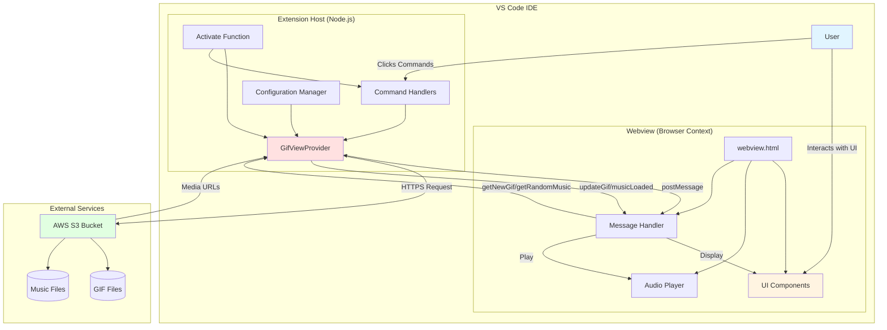

# Let Him Cook Now - Architecture Diagram

## Component Descriptions

### Extension Host (Node.js)
- **Activate Function**: Initializes extension and registers commands
- **Command Handlers**: Handles VS Code commands (next, toggle music, stop, refresh)
- **GifViewProvider**: Core logic for GIF/music management and S3 integration
- **Configuration Manager**: Reads workspace settings for S3 bucket configuration

### Webview (Browser Context)
- **webview.html**: Main UI template with HTML/CSS/JavaScript
- **UI Components**: GIF display, buttons, countdown progress bar
- **Audio Player**: HTML5 audio element for music playback
- **Message Handler**: Bidirectional communication bridge with extension host

### External Services
- **AWS S3 Bucket**: Cloud storage hosting GIF and music files
- Public bucket serving media content via HTTPS

## Data Flow

1. **User Action** → VS Code Command
2. **Command** → GifViewProvider method
3. **Provider** → S3 HTTPS Request
4. **S3** → Returns media file list/URLs
5. **Provider** → Sends message to Webview
6. **Webview** → Displays GIF or plays music
7. **Webview** → Sends state updates back to Extension
